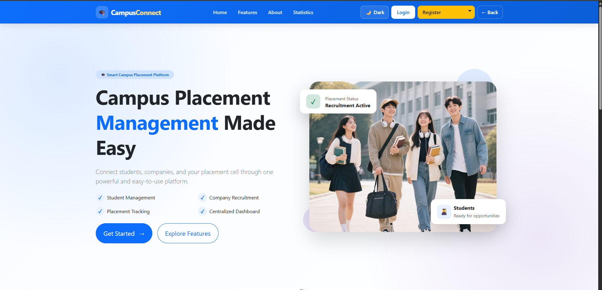

# COMPUSCONNECT

## 📌 Overview

**COMPUSCONNECT** is a full-stack placement management web application built to connect **students, companies, colleges, and administrators** on a centralized platform.

The application provides role-based dashboards and features for managing placement opportunities, student applications, company information, and administrative activities. It uses a **Vue.js 3 frontend** integrated with a **Flask REST API backend**, with SQLAlchemy for database operations and Redis/Celery for caching and background task processing.

---

## 🛠️ Technology Stack

| Technology / Library        | Purpose                                                   |
| --------------------------- | --------------------------------------------------------- |
| **Flask**                   | Backend framework for REST APIs and business logic        |
| **Vue.js 3**                | Frontend framework for dynamic and interactive dashboards |
| **SQLAlchemy**              | ORM for database operations                               |
| **Vue Router**              | Frontend routing and role-based navigation                |
| **Axios**                   | HTTP communication between Vue.js and Flask               |
| **Flask-JWT-Extended**      | JWT-based authentication and authorization                |
| **Redis**                   | Caching and Celery message broker                         |
| **Celery**                  | Asynchronous background task processing                   |
| **Celery Beat**             | Scheduled background task execution                       |
| **Bootstrap 5**             | Responsive UI and frontend components                     |
| **CSS**                     | Custom styling and interface design                       |
| **Flask-Caching**           | Redis-based caching for Flask APIs                        |
| **Flask-CORS**              | Communication between frontend and backend                |
| **Flask-Migrate / Alembic** | Database schema migration management                      |
| **Werkzeug**                | Password hashing and security utilities                   |

---

## ⭐ Key Features

### 🔐 Authentication & Authorization

* User login and authentication
* JWT-based authentication
* Role-based authorization
* Protected API endpoints
* Password hashing using Werkzeug

### 👨‍💼 Admin Management

* Admin dashboard
* Manage and monitor users
* Access administrative functionality
* View platform-related information

### 🏢 Company Management

* Company dashboard
* Manage company information
* Create and manage placement opportunities
* View and manage student applications

### 🎓 Student Management

* Student dashboard
* View available placement opportunities
* Apply for opportunities
* Track application status
* Manage student information

### 🏫 College Management

* College-related management
* Access placement-related information
* Manage relevant student/company information

### 📊 Dashboard & Data Management

* Role-specific dashboards
* Dynamic data through REST APIs
* CRUD operations
* Placement and application management

### ⚙️ Background & Scheduled Tasks

* Asynchronous processing using **Celery**
* Scheduled tasks using **Celery Beat**
* Redis used as the Celery message broker

### 🚀 Caching

* Flask-Caching integration
* Redis-based caching
* Improved API performance by reducing repeated database queries

### 🌐 Frontend & API Integration

* Vue.js 3 frontend
* Flask REST APIs
* Axios for frontend-backend communication
* Vue Router for navigation
* Flask-CORS for cross-origin communication
* Responsive UI using Bootstrap 5
* Custom CSS styling
